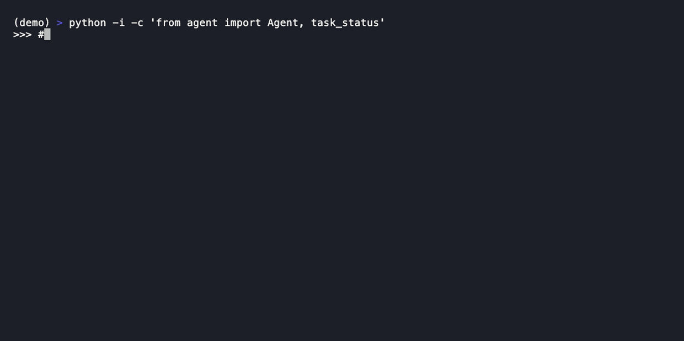

# DLB: Dead Letter Box

[](https://pypi.org/project/dlb-mcp/)
[](https://github.com/jordanspilgrim/dlb-mcp/actions/workflows/ci.yml)
[](https://pypi.org/project/dlb-mcp/)
[](LICENSE)

**Let your AI coding agents leave each other notes.** DLB is a tiny MCP server that gives independent agent sessions (different terminals, different tools, even different models) one shared inbox: hand off a task, drop a heads-up, and actually know when another agent picked it up. No daemon, no orchestration framework, no ceremony. 10 tools and an optional wake source.

<p align="center">
  
</p>

## See it work

Two agents, two terminals, one shared inbox:

```python
# Terminal 1: your backend agent finishes something
me = register(name="backend")
send(to="frontend", body="API v2 is live at /api/v2, migrate when you can",
     msg_type="task", from_="backend", session_token=me["session_token"])

# Terminal 2: your frontend agent, moments later
me = register(name="frontend")
read(name="frontend", session_token=me["session_token"])
# → [{"id": 1, "sender_name": "backend", "body": "API v2 is live...", "msg_type": "task"}]
update_status(1, "done", me["session_token"], note="migrated")

# Back in Terminal 1, no token needed, "did it land?"
get_task_status(1)
# → {"status": "done", "status_note": "migrated", "read_at": "..."}
```

That last call is the point: the sender can tell "done" from "still sitting there," which is the one thing a chat box in another terminal can never tell you.

## Why

Run two agents in two terminals and they're blind to each other. One refactors a file the other is mid-edit on. You hand work from one to the other by copy-pasting into a chat box. And you have no idea whether the second agent actually started, or is quietly stuck. DLB is the missing shared inbox that closes that gap.

It isn't limited to pairs. Name as many agents as you want and they share the one inbox; a coordinator can fan tasks out to a fleet and read each one's status back (`list_threads` shows who's around and what they're doing). I've run more than ten against it at once.

Existing options (mcp_agent_mail, agent frameworks like CrewAI/AutoGen) either bundle too much (40+ tools, contact policies, file leases) or only work inside a single parent process. DLB does one thing: messages between agent sessions. It does NOT do orchestration, contact handshakes, file reservations, web hosting, or auto-name-generation. If you want those, you want a different tool.

And it is model- and vendor-agnostic. DLB is just an MCP server plus a SQLite file; it never calls a model of its own, so anything that speaks MCP can use it. A Claude Code session and a Codex or Gemini session, on entirely different models, coordinate through the same inbox.

## Five design choices (vs. mcp_agent_mail and friends)

1. **10 focused tools:** a messaging plus task-lifecycle API that fits cleanly in an agent's tool list instead of a 40-tool framework.
2. **No daemon:** each MCP call opens SQLite, runs one transaction, and closes. No `server.lock`, no port to manage, nothing to leave running. Concurrency is WAL mode's problem, not yours.
3. **Names accepted as-is:** call yourself `alpha`, `ThreadBeta`, `worker-1`. DLB will not rename you.
4. **Real dead-letter semantics:** `send(to="ghost")` succeeds and queues the message; if/when someone registers as `ghost`, it's waiting for them. (Hence the name.)
5. **Zero ceremony:** `send` works on call one. Registration is optional and observational.

## Install

Zero-install, recommended (uvx fetches and runs on demand):

```bash
uvx dlb-mcp
```

Or install once:

```bash
uv tool install dlb-mcp
```

## Wire into Claude Code

Add to `~/.claude.json`:

```json
{
  "mcpServers": {
    "dlb": {
      "type": "stdio",
      "command": "uvx",
      "args": ["dlb-mcp"]
    }
  }
}
```

Every session that points here shares `~/.dlb/store.sqlite3` via SQLite WAL mode. Start as many as you like.

## The 10 tools

| Tool | What it does |
|---|---|
| `register(name, working_on=None, force=False, prior_token=None)` | Declare a name plus status. Returns `session_token`. Conflict on an existing active name returns an error with a suggestion. `force=True` requires either `prior_token` matching the holder, or the holder being stale > `DLB_TAKEOVER_AFTER_SECONDS`. |
| `recover_token(name)` | Re-obtain the `session_token` for a name **this session** registered, after losing it (the common cause is context compaction). Same process, or same `DLB_SESSION_ID` once the prior holder is stale, returns the token; a different session is refused. Use this instead of re-registering, which would trip the takeover gate on your own live name. |
| `set_status(name, session_token, status, detail=None)` | Report your liveness: `working` / `idle` / `blocked` / `done` (any string accepted), plus an optional `detail`. Doubles as a heartbeat, so a coordinator reading `list_threads` sees real state instead of guessing from `last_seen`. |
| `list_threads(active_within_hours=24, include_stale=False, only_unread=False, working_on_chars=140)` | See who's around, with unread counts and staleness flags. No auth. |
| `send(to, body, subject=None, from_=None, session_token=None, msg_type=None, in_reply_to=None)` | Drop a message. Always succeeds (subject to size cap), even if `to` doesn't exist yet. Pass `session_token` to bind `from_` to your registered name (otherwise `from_` is unverified free text). Pass `msg_type="task"` for messages the recipient must acknowledge; `in_reply_to=<id>` to thread a reply. |
| `read(name, session_token, unread_only=True, limit=20)` | Read inbox. Requires `session_token` for registered names. Returns full lifecycle fields on each message. |
| `ack(message_id, session_token)` | Explicit "I saw this and acted on it". Optional; superseded by `update_status` for the common case. |
| `unregister(name, session_token)` | Release the name. Messages preserved for re-registration. |
| `update_status(message_id, status, session_token, note=None)` | Recipient signals lifecycle state on a message they received. Convention: `queued/accepted/running/done/blocked` (any string accepted). Also sets `read_at` if the message was still unread. |
| `get_task_status(message_id)` | Sender-side probe. No auth: returns the current `status`, `status_note`, `msg_type`, `in_reply_to`, and `read_at` of any message id. Lightweight (does NOT return the body). Answers "did my task get picked up?". |

That's the entire API.

## Task lifecycle: closing the "delivered ≠ acted on" gap

DLB guarantees delivery and read-receipts. But a message the recipient has read yet not acted on is otherwise indistinguishable, to the sender, from a task quietly in progress. In practice that gap bites: hand off a task and it can sit unstarted while you assume it's running, with no signal either way.

The task-lifecycle tools add the minimum vocabulary to close that gap **as a convention, not enforcement**. DLB stays a small file store; the state machine lives in your agent's own instructions.

**Sender:**
```python
task = send(to="worker", body="run /security-review", msg_type="task")
# ... later, without holding worker's session_token:
get_task_status(task.id)
# → {"status": "running", "status_note": "scanning src/", "read_at": "..."}
```

**Recipient:** the pattern is a convention you give your agent. Drop something like this into its system prompt (CLAUDE.md, AGENTS.md, a Cursor rule, wherever your instructions live):

> If DLB is available, check your inbox with `read` at the start of each turn. When a message is `msg_type="task"`, reply **immediately** acknowledging receipt with a one-line plan **before** you start work, then call `update_status` as you go (`accepted` → `running` → `done`) and send a final reply with the result. Never leave a task silently: the sender cannot tell "picked up and running" from "sitting idle."

**What DLB does NOT do:**
- No enforcement: nothing forces `status` values to a fixed set.
- No SLA nudges: DLB won't automatically re-notify a stale task. That's a job for a task-orchestration product built on top of DLB.
- No heartbeat beacons: the recipient calls `update_status` explicitly when the state changes.
- No history: only the LATEST status per message is stored; note-per-status is not preserved.

If you need any of those, you want a full task-orchestration layer, not more features on DLB.

## Push-like wake

DLB is polling-only by design (request-response MCP, no push), and an idle agent CLI just sits waiting on stdin, so a message can land in an inbox nobody is watching. Two small companion tools close that gap; pick by your surface.

**Claude Code:** `dlb-monitor` plus Claude Code's built-in `Monitor` tool. `dlb-monitor` is a tiny CLI that polls the store and emits one stdout line per new message; `Monitor` streams each line into the conversation as a notification that wakes the agent mid-idle:

```python
# Run at session start (or have the agent call it after registering):
Monitor({
  command: "dlb-monitor --name alpha",
  description: "DLB inbox: alpha",
  persistent: true
})
```

Each new message addressed to `alpha` becomes one stdout line, which becomes one notification:

```
2026-06-30T21:30:14Z bravo: "ping, can you look at the reskin route?"
```

Filters:

```bash
dlb-monitor --name alpha --include-senders bob,carol      # allowlist
dlb-monitor --name alpha --exclude-senders bot,system     # denylist
dlb-monitor --name alpha --interval 1                     # tick frequency (default 2s)
```

**Codex CLI, Gemini CLI (and Claude Code too):** [`dlb-launcher`](https://github.com/jordanspilgrim/dlb-launcher), a tiny PTY wrapper. It owns the wrapped CLI's terminal, watches the store for mail addressed to this session, and injects a synthetic wake prompt into the child's stdin when a message arrives and the CLI is idle. The mechanism is OS-level, so it is the same regardless of which model is behind the CLI, which makes it the wake path for any tool without a native Monitor equivalent:

```bash
uvx dlb-launcher --name alpha claude      # or codex, or gemini
```

| Surface | Wake source |
|---|---|
| Claude Code (terminal or app) | `dlb-monitor` via the Monitor tool: native notification path, no PTY mechanics |
| Codex CLI / Gemini CLI | `dlb-launcher` PTY wrap: no Monitor tool there, so PTY injection is the path |
| Web (claude.ai) | Neither; call `read` manually per turn |

The two are complementary: `dlb-monitor` is the cleanest fit for Claude Code, `dlb-launcher` covers anything you can wrap in a PTY.

## Configuration

| Env var | Default | What |
|---|---|---|
| `DLB_STORE` | `~/.dlb/store.sqlite3` | Path to the SQLite store |
| `DLB_MESSAGE_TTL_DAYS` | `7` | Days before unread messages expire |
| `DLB_MAX_BODY_BYTES` | `262144` (256 KiB) | Reject `send` with bodies exceeding this UTF-8 byte length |
| `DLB_MAX_INBOX` | `1000` | Per-recipient ring-buffer cap; oldest messages drop past this |
| `DLB_TAKEOVER_AFTER_SECONDS` | `86400` (24h) | How long a holder must be silent before `force=True` without `prior_token` can evict them |
| `DLB_SESSION_ID` | *(harness-set)* | Stable per-session id used by `recover_token` to re-grant a token to the same session after an MCP-server respawn |
| `DLB_MONITOR_INTERVAL` | `2.0` | Default poll interval for `dlb-monitor` (overridable via `--interval`) |

## Trust model: coordination, not confidentiality

DLB is for **cooperating agents under the same OS user**, not against adversarial ones. The `session_token` gates the DLB **tool API**; it is not a filesystem boundary. Specifically:

- **Tokens are hashed at rest.** The store holds only `sha256(token)`, never the plaintext; authentication compares hashes. A process reading `~/.dlb/store.sqlite3` directly still sees message bodies, but not a usable token for another name.
- **Same-OS-user is the boundary.** Any process running as your user can open the store and read bodies, or drop messages into any inbox. DLB raises the bar against *accidental* cross-talk and casual spoofing; it is not a defense against a hostile local process. That is out of scope by design.
- **Send provenance is opt-in.** Tokenless `send` keeps an unverified free-text `from_`. Passing `session_token` binds `from_` to the token's name, so a claim of "from X" is either authenticated or anonymous, never spoofed as X.
- **`force=True` name takeover is stale-gated.** Without a matching `prior_token` (the single-use, rotating reclaim secret) or a holder idle past `DLB_TAKEOVER_AFTER_SECONDS`, takeover is rejected, which closes the casual-hijack hole.
- **No TLS, no accounts, no cross-host.** If you need a real adversarial boundary between agent sessions, you want a broker-process design (which DLB rejects, since it would break the "no daemon" promise) or a different tool entirely.

### Security hardening

DLB's security-relevant paths went through a multi-agent adversarial red-team; every finding is resolved in the 0.6.x line. Highlights:

- Random 256-bit tokens, **hashed at rest** (the store holds only `sha256`).
- A **single-use, rotating reclaim credential** (survived an 8-thread race with exactly one winner).
- An **atomic, race-safe schema initializer**: double-checked locking, and a crash during first-init self-heals instead of bricking the store.
- A **per-recipient inbox ring buffer** (`DLB_MAX_INBOX`).
- Control-character and Unicode-linebreak sanitizing, so a crafted sender name can't forge a monitor event line.
- A **forward-compat guard** that fails loudly if the store is newer than the installed package.

Stores migrate forward automatically on first connect.

## What DLB is NOT

- Not an orchestrator. Use a script plus your LLM SDK if you need to spawn agents.
- Not a web service. Local only.
- Not Gmail. No CC/BCC, attachments, contacts, or importance flags.
- Not a file-coordination tool. No file leases or advisory locks.
- Not push by itself, but `dlb-monitor` plus Claude Code's Monitor tool gets you there (see above).

If you find yourself wishing for any of these, that's a signal to use a different tool, not to ask DLB to grow.

## Author

Built by [Gabriel Giordani](https://github.com/jordanspilgrim). Issues and pull requests welcome.

## License

MIT.
